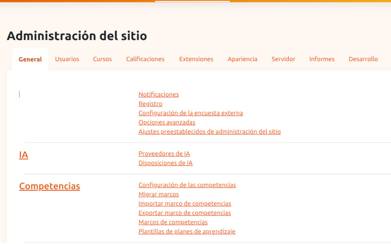
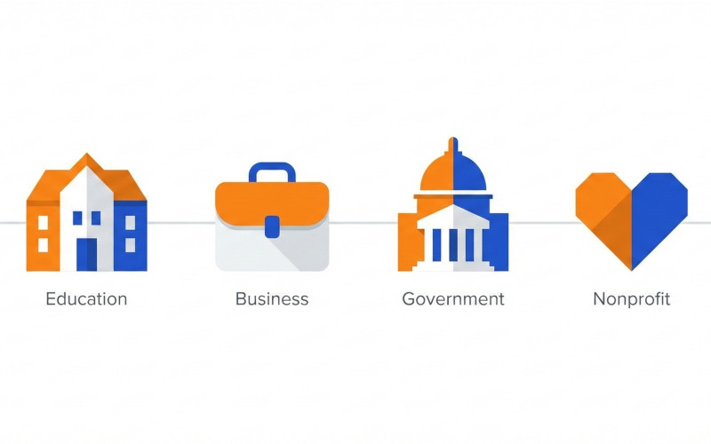

Con más de 160.000 sitios web registrados y una comunidad de más de 360 millones de usuarios en más de 240 países, Moodle se ha consolidado como el sistema de gestión de aprendizaje (LMS) de código abierto más utilizado del mundo.

Si estás considerando crear tu propia plataforma educativa, has llegado al lugar indicado. En esta guía exploraremos todo lo que necesitas saber sobre Moodle: desde sus fundamentos hasta consideraciones técnicas de hosting, pasando por sus funcionalidades y cómo se compara con la competencia.

<!-- IMAGEN SUGERIDA: Dashboard principal de Moodle o logo oficial -->

## Conociendo Moodle

### ¿Es fácil de usar?

Esta es probablemente la pregunta más frecuente entre quienes se acercan por primera vez a Moodle. Las opiniones varían considerablemente: algunos afirman que está diseñado pensando en programadores, mientras otros aseguran que incluso los novatos pueden manejarlo sin problemas.

La realidad está en un punto intermedio.

**No necesitas saber programar** para administrar un sitio Moodle. La plataforma cuenta con un panel de administración intuitivo, con una interfaz de apuntar y hacer clic que incluye todas las herramientas necesarias para gestionar tus cursos. Además, la mayoría de los servicios de hosting ofrecen instaladores automáticos que te permiten tener Moodle funcionando en cuestión de minutos.

Sin embargo, si es tu primer proyecto con Moodle, te recomendamos invertir tiempo en familiarizarte con la plataforma. No basta con explorar los menús y botones del backend; es fundamental entender cómo funciona Moodle, qué puede hacer y qué necesitas para mantener tu sitio en óptimas condiciones.

### Aspectos clave para empezar

- **Instalación**: La mayoría de proveedores ofrecen instalación con un clic
- **Interfaz**: Panel de administración visual sin necesidad de código
- **Curva de aprendizaje**: Moderada, requiere dedicación inicial
- **Documentación**: Extensa comunidad y recursos disponibles

## Hosting para Moodle

El éxito de tu proyecto e-learning depende en gran medida de garantizar que los cursos sean accesibles desde cualquier lugar y en cualquier momento. Esto significa encontrar el servicio de hosting adecuado.

Moodle está escrito en PHP y es compatible con los servidores web y sistemas de gestión de bases de datos más populares. Funciona tanto en Windows como en Linux. Sin embargo, encontrar el hosting ideal no es tan sencillo como parece.

### Requisitos técnicos clave

#### Almacenamiento

Los cursos online modernos incluyen gran cantidad de contenido multimedia: vídeos, imágenes, documentos interactivos. Esto hace que los cursos sean más atractivos y fáciles de asimilar, pero también implica requisitos de almacenamiento considerables.

#### Potencia de procesamiento y memoria

Gracias a los plugins, puedes ampliar la funcionalidad de Moodle con todo tipo de características adicionales. Cada uno de estos complementos consume recursos del servidor, por lo que debes asegurarte de que tu plan de hosting pueda soportarlos.

#### Velocidad de carga

Todos los sitios web necesitan cargar rápido, pero esto es especialmente crítico en plataformas educativas. Para garantizar el éxito de tus cursos, los estudiantes deben poder mantener su atención el mayor tiempo posible, algo difícil de conseguir si el sitio tarda una eternidad en cargar.

#### Seguridad y cumplimiento normativo

El tipo y configuración del hosting también afectan la postura de seguridad de tu sitio. En una plataforma educativa donde se manejan datos de usuarios —especialmente si son menores—, el cumplimiento del RGPD es fundamental.

### Opciones de hosting: visión general

| Tipo de Hosting | Ideal para | Ventajas | Inconvenientes |
|-----------------|------------|----------|----------------|
| **Compartido** | Pruebas, proyectos muy pequeños | Económico, fácil de empezar | Recursos limitados, rendimiento inconsistente |
| **VPS genérico** | Proyectos medianos con equipo técnico | Control total, precio moderado | Requiere conocimientos de sysadmin |
| **Hosting Moodle gestionado** | Instituciones, empresas, formadores | Todo incluido, soporte especializado | Coste mensual fijo |
| **Cloud (AWS, GCP)** | Grandes instituciones | Máxima escalabilidad | Complejidad, costes variables |

### El problema del hosting genérico

Muchas instituciones educativas cometen el error de contratar un hosting compartido o un VPS genérico pensando que "Moodle funcionará igual en cualquier sitio". La realidad es muy diferente:

- **Picos de carga en exámenes**: Cuando 200 alumnos entran a la vez a un examen, un servidor mal dimensionado colapsa
- **Configuración subóptima**: MySQL en lugar de PostgreSQL, sin Redis para caché, PHP sin optimizar
- **Sin autoscaling**: No hay forma de absorber picos puntuales de demanda
- **Soporte genérico**: El técnico no conoce Moodle y no puede ayudarte con problemas específicos

<!-- IMAGEN SUGERIDA: Diagrama de arquitectura servidor-base de datos para Moodle -->

## Construyendo tu Sitio Moodle

### ¿Por qué Moodle es tan popular?

Lanzado por primera vez en agosto de 2002, Moodle ha desempeñado un papel fundamental en la formación del concepto de educación online tal como lo conocemos. Profesores y estudiantes de todo el mundo están familiarizados con él y satisfechos con los resultados que produce.

Pero la antigüedad no lo es todo. Moodle no sería tan popular si no fuera **versátil**. Ha permitido que escuelas y universidades implementen educación online en sus programas, pero también ha impulsado innumerables proyectos de corporaciones, organizaciones gubernamentales, ONGs y más.

### La arquitectura modular: la clave del éxito

El nombre "Moodle" es un acrónimo de *Modular Object-Oriented Dynamic Learning Environment* (Entorno de Aprendizaje Dinámico Modular Orientado a Objetos). La palabra clave aquí es **modular**.

Esta arquitectura significa que puedes habilitar funcionalidades que de otro modo llevarían meses implementar, simplemente instalando un plugin. Adaptar Moodle a las últimas tendencias del mundo e-learning es mucho más sencillo, y como está construido sobre una base de código mantenida por una gran comunidad de programadores, los errores se corrigen con rapidez.

### Funcionalidades principales

Moodle ofrece un amplio abanico de posibilidades:

- **Creación de cursos**: Estructura flexible con múltiples formatos
- **Evaluaciones**: Cuestionarios, tareas, rúbricas personalizables
- **Aulas virtuales**: Integración con herramientas de videoconferencia como BigBlueButton
- **Gamificación**: Insignias, puntos y sistemas de recompensas
- **Informes y analíticas**: Seguimiento del progreso de estudiantes
- **Restricciones de actividad**: Control granular del acceso al contenido

### Casos de uso

| Sector | Aplicación |
|--------|------------|
| **Educación** | Universidades, colegios, formación profesional |
| **Empresas** | Capacitación corporativa, onboarding |
| **Gobierno** | Formación de funcionarios públicos |
| **ONGs** | Programas de formación y sensibilización |
| **Freelancers** | Venta de cursos online propios |

<!-- IMAGEN SUGERIDA: Infografía con iconos representando los diferentes casos de uso -->

## Moodle vs. la Competencia

### El panorama actual de plataformas LMS

Históricamente, la competencia de Moodle provenía principalmente de otros sistemas LMS de código abierto. Más recientemente, han surgido numerosas soluciones basadas en el modelo Software-as-a-Service (SaaS).

La oferta es más amplia que nunca, pero si tuviéramos que resumir, diríamos que **intentar igualar a Moodle siempre será un desafío** para los competidores.

### Ventajas competitivas de Moodle

1. **Código abierto**: Sin costes de licencia, personalización total
2. **Comunidad masiva**: Soporte, plugins y actualizaciones constantes
3. **Madurez**: Más de 20 años de desarrollo y mejoras
4. **Flexibilidad**: Se adapta a cualquier tipo de proyecto
5. **Escalabilidad**: Desde pequeños cursos hasta universidades enteras

### Comparativa de plataformas LMS

| Característica | Moodle | Blackboard | Canvas | Soluciones SaaS |
|----------------|--------|------------|--------|-----------------|
| **Coste inicial** | Gratuito | Alto | Variable | Suscripción |
| **Personalización** | Total | Limitada | Moderada | Limitada |
| **Plugins** | Miles disponibles | Pocos | Moderados | Depende |
| **Control de datos** | Total | Parcial | Parcial | Limitado |
| **Curva de aprendizaje** | Moderada | Moderada | Baja | Baja |
| **Soporte** | Comunidad | Incluido | Incluido | Incluido |
| **RGPD** | Tú controlas | Depende ubicación | Depende | Revisar contrato |

### ¿Cuándo elegir Moodle?

Moodle es especialmente recomendable cuando:

- Necesitas **control total** sobre tu plataforma y datos
- Tienes requisitos de **personalización específicos**
- Buscas una solución **sin costes de licencia**
- Planeas **escalar** tu proyecto a largo plazo
- Valoras una **comunidad activa** de soporte
- Debes cumplir con **normativas de protección de datos** (RGPD)

### ¿Cuándo considerar alternativas?

Podrías evaluar otras opciones si:

- Necesitas estar operativo **inmediatamente** sin configuración técnica
- No cuentas con recursos técnicos para administración
- Tu proyecto es muy pequeño y no justifica la inversión de tiempo
- Prefieres un modelo de **soporte garantizado** incluido

<!-- IMAGEN SUGERIDA: Tabla comparativa visual tipo infografía -->

## Comparativa de Opciones de Hosting para Moodle

Una vez decidido que Moodle es la plataforma adecuada, la siguiente pregunta crítica es: **¿dónde alojarlo?**

Esta decisión es más importante de lo que parece. Un Moodle mal alojado significa exámenes caídos, alumnos frustrados y noches sin dormir para el responsable técnico.

### Las tres opciones principales

| Característica | MetisHost | Hosting genérico | VPS propio (DIY) |
|----------------|-----------|------------------|------------------|
| **Autoscaling automático** | ✅ Incluido | ❌ No disponible | ❌ Muy complejo |
| **Soporte especializado Moodle** | ✅ En español, <4h | ❌ Genérico | ❌ Tú eres el soporte |
| **PostgreSQL + Redis optimizado** | ✅ Preconfigurado | ❌ MySQL básico | ⚠️ Tú lo configuras |
| **Alta disponibilidad (HA)** | ✅ Multi-nodo | ❌ Servidor único | ⚠️ Muy complejo |
| **Actualizaciones gestionadas** | ✅ <48h tras release | ❌ No incluido | ⚠️ Manual |
| **Backups automáticos** | ✅ Diarios, 30 días | ⚠️ Variable | ⚠️ Manual |
| **Cumplimiento RGPD** | ✅ 100% UE | ⚠️ Verificar | ⚠️ Tu responsabilidad |
| **Precio predecible** | ✅ Fijo mensual | ⚠️ Variable por tráfico | ✅ Fijo |
| **Tiempo de setup** | 15 minutos | 1-2 horas | 1-2 días |
| **Noches sin dormir** | 0 | Algunas | Muchas |

### ¿Por qué un hosting Moodle gestionado?

La diferencia fundamental entre un hosting gestionado especializado y las alternativas genéricas está en **quién resuelve los problemas**.

Con un VPS propio o un hosting compartido:
- Tú investigas por qué Moodle va lento
- Tú configuras el servidor cuando hay un pico de exámenes
- Tú te levantas a las 3AM si el servidor cae
- Tú aplicas los parches de seguridad

Con un hosting Moodle gestionado como MetisHost:
- El autoscaling absorbe los picos automáticamente
- Las actualizaciones de seguridad se aplican en menos de 48 horas
- El soporte especializado conoce Moodle y resuelve problemas específicos
- Tú te dedicas a lo importante: **crear buenos cursos**

### Stack tecnológico recomendado para Moodle

Basándonos en nuestra experiencia, esta es la configuración óptima para un Moodle en producción:

| Componente | Recomendación | Por qué |
|------------|---------------|---------|
| **Base de datos** | PostgreSQL 16 | Mejor rendimiento que MySQL para Moodle |
| **Caché** | Redis | Acelera sesiones y caché de aplicación |
| **PHP** | 8.3 con OPcache + JIT | Máximo rendimiento |
| **Servidor web** | Nginx o Traefik | Mejor manejo de conexiones concurrentes |
| **CDN/WAF** | Cloudflare | Caché global y protección DDoS |
| **SSL** | Let's Encrypt | Certificados automáticos y gratuitos |

<!-- IMAGEN SUGERIDA: Diagrama de arquitectura con los componentes del stack -->

## Conclusión y Próximos Pasos

Moodle ha demostrado durante más de dos décadas por qué es el líder indiscutible en el mundo de los sistemas de gestión de aprendizaje de código abierto. Su arquitectura modular, la comunidad que lo respalda y su versatilidad lo convierten en una opción sólida para prácticamente cualquier proyecto e-learning.

Sin embargo, **elegir Moodle es solo la mitad de la ecuación**. La otra mitad es asegurarte de que tu plataforma esté bien alojada, correctamente configurada y respaldada por un soporte que entienda tus necesidades.

### Para empezar con Moodle

1. **Define tu proyecto**: ¿Qué tipo de cursos ofrecerás? ¿A qué audiencia? ¿Cuántos usuarios concurrentes esperas?
2. **Elige tu hosting**: Evalúa tus necesidades de rendimiento, soporte y cumplimiento normativo
3. **Instala o migra**: Con el hosting adecuado, puedes estar operativo en minutos
4. **Configura y personaliza**: Adapta Moodle a tus necesidades específicas
5. **Crea tu primer curso**: Empieza con algo sencillo y ve ampliando

### Recursos recomendados

- [Documentación oficial de Moodle](https://docs.moodle.org)
- [Foros de la comunidad Moodle](https://moodle.org/course/view.php?id=5)
- [Directorio de plugins](https://moodle.org/plugins/)
- [MoodleNet](https://moodlenet.io/) - Red para compartir recursos educativos

---

## ¿Listo para empezar?

Si quieres olvidarte de los problemas técnicos y centrarte en lo que realmente importa —crear cursos que transformen a tus alumnos—, [prueba MetisHost gratis](/). 

Migración gratuita, setup en 15 minutos y soporte humano en español. Sin compromiso de permanencia.

[**Empezar prueba gratis →**](/)